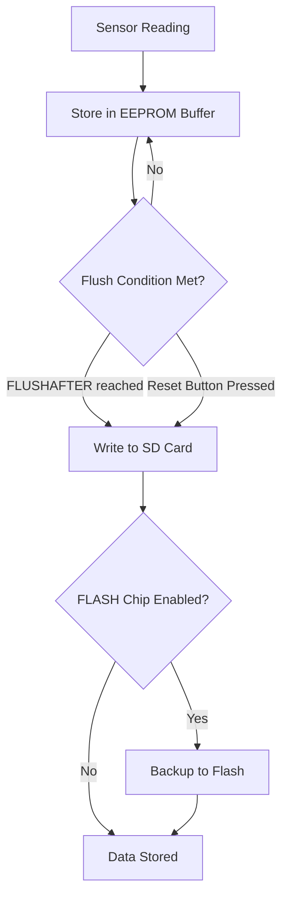

## Functionality of the SD card slot

Some Riverlabs loggers come with an SD card slot for local data storage. This is needed when the logger is deployed without telemetry.

The logger contains an EEPROM chip of 512 kbit, which it uses as internal buffer to store readings to reduce the number of writings to the SD card and to optimise power consumption. The frequency with which the data are flushed from the EEPROM to the SD card can be set in the code by editing the following line:

`#define FLUSHAFTER 288`

The default option is equivalent to once a day at a measurement interval of 5 minutes. EEPROM is non-volatile memory so the written data are retained even when the battery is removed.

The logger will also flush the EEPROM when it is reset. Pushing the reset button before taking out the SD card will therefore ensure that all the latest data are written to the SD card. The LED will light up during the flushing process. This can take several seconds, depending on the amount of data to be transferred. 

A flash chip can also be installed on some board varients to backup data (especially helpful for telemetered loggers), this is activated in the firmware using:

`#define FLASH`

A flow chart of this is shown below:

!!! danger Do not take out the SD card while the LED light is on, as this may damage the card and make it unreadable.**

## Inserting and removing the SD card

### Inserting the SD card

1. Push the SD card gently into the slot until it is fully inserted
2. Ensure the card is correctly oriented with the contacts facing outward (away from the battery)
3. Press the **RESET** button to initialize the logger with the SD card
4. Wait for the LED indicator:
    - Brief pause followed by a long red pulse indicates data is being flushed from EEPROM to SD card

### Removing the SD card

!!! warning "Always flush data before removal"
     Follow these steps to prevent data loss:

1. Press the **RESET** button to flush any buffered data
2. Wait for the LED to show a red pulse (indicating data transfer)
3. Once the LED turns off, safely remove the SD card by pulling it out gently

!!! tip
     The flushing process may take several seconds depending on the amount of buffered data. Never remove the SD card while the LED is illuminated.

## Data storage on the SD card

In the standard setup, the sensor takes 10 consecutive distance readings. This takes about 10&nbps;ms for the lidar, and 1.5&nbsp;s for the ultrasound sensor. In addition, it will take a measurement of the temperature sensor on the clock chip, and a voltage reading of the battery.

The SD card is formatted in standard FAT format. Any micro SD and micro SDHC card can be used. The SD card can be read with a PC without any specific software. The logger writes one file per day in text formar, with file name format YYYYMMDD.CSV. The content of the file is formatted as follows:

`2019/01/01 12:00:00, 2215, 2214, 2214, 2215, 2214, 2214, 2214, 2214, 2215, 2215, 4100, 1950`

In which each line represents one measurement period, and the columns are respectively:
- Column 1: date and time in format YYYY/MM/DD HH:MM:SS
- Columns 2 – 11: Raw distance measurements [mm].
- Column 12: battery voltage [mV]. A full battery sits around 4200&nbsp;mV. The logger shuts down when voltage drops below around 3500mV.
- Column 13: logger temperature in 1/100&deg;C (so a value of 1950 = 19.50&deg;C).

The logger will operate without an SD card inserted. However, the data in the internal memory will be overwritten when the memory is full.