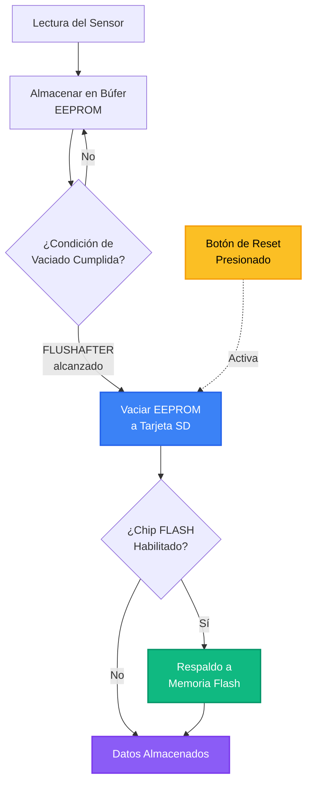

## Funcionalidad del Ranura de la Tarjeta SD

Algunos registradores Riverlabs vienen con un ranura de tarjeta SD para almacenamiento de datos local. Esto es necesario cuando el registrador se implementa sin telemetría.

El registrador contiene un chip EEPROM de 512 kbit, que usa como búfer interno para almacenar lecturas y reducir el número de escrituras en la tarjeta SD y optimizar el consumo de energía. La frecuencia con la que los datos se vacían de la EEPROM a la tarjeta SD se puede configurar en el código editando la siguiente línea:

`#define FLUSHAFTER 288`

La opción predeterminada equivale a una vez al día con un intervalo de medición de 5 minutos. La EEPROM es memoria no volátil, por lo que los datos escritos se conservan incluso cuando se retira la batería.

El registrador también vaciará la EEPROM cuando se resetee. Por lo tanto, presionar el botón de reset antes de sacar la tarjeta SD garantizará que todos los datos más recientes se escriban en la tarjeta SD. El LED se iluminará durante el proceso de vaciado. Esto puede tardar varios segundos, dependiendo de la cantidad de datos a transferir.

En algunas variantes de la placa también se puede instalar un chip flash para hacer copia de seguridad de los datos (especialmente útil para registradores con telemetría), que se activa en el firmware usando:

`#define FLASH`

A continuación se muestra un diagrama de flujo de esto:

!!! danger "Advertencia de Seguridad de Datos"
    No saque la tarjeta SD mientras el LED esté encendido, ya que esto puede dañar la tarjeta y hacerla ilegible.

## Inserción y Extracción de la Tarjeta SD

### Inserción de la Tarjeta SD

1. Empuje la tarjeta SD suavemente en el ranura hasta que esté completamente insertada
2. Asegúrese de que la tarjeta esté correctamente orientada con los contactos hacia afuera (alejados de la batería)
3. Presione el botón **RESET** para inicializar el registrador con la tarjeta SD
4. Espere el indicador LED:
    - Una breve pausa seguida de un largo pulso rojo indica que los datos se están vaciando de la EEPROM a la tarjeta SD

### Extracción de la Tarjeta SD

!!! warning "Siempre Vacíe los Datos Antes de Retirar"
     Siga estos pasos para evitar la pérdida de datos:

    1. Presione el botón **RESET** para vaciar los datos en búfer
    2. Espere a que el LED muestre un pulso rojo (indicando transferencia de datos)
    3. Una vez que el LED se apague, retire la tarjeta SD de forma segura tirando de ella suavemente

!!! tip "Vaciado de Datos"
     El proceso de vaciado puede tardar varios segundos dependiendo de la cantidad de datos en búfer. Nunca retire la tarjeta SD mientras el LED esté iluminado.

## Almacenamiento de Datos en la Tarjeta SD

En la configuración estándar, el sensor toma 10 lecturas de distancia consecutivas. Esto tarda unos 10&nbsp;ms para el lidar y 1.5&nbsp;s para el sensor de ultrasonido. Además, tomará una medición del sensor de temperatura en el chip del reloj y una lectura de voltaje de la batería.

La tarjeta SD está formateada en formato FAT estándar. Se puede usar cualquier tarjeta microSD y microSDHC. La tarjeta SD se puede leer con un PC sin ningún software específico. El registrador escribe un archivo por día en formato de texto, con el formato de nombre de archivo `YYYYMMDD.CSV`. El contenido del archivo tiene el siguiente formato:

`2019/01/01 12:00:00, 2215, 2214, 2214, 2215, 2214, 2214, 2214, 2214, 2215, 2215, 4100, 1950`

donde cada línea representa un período de medición y las columnas son, respectivamente:

- **Columna 1**: fecha y hora en formato YYYY/MM/DD HH:MM:SS
- **Columnas 2–11**: Medidas de distancia brutas (mm).
- **Columna 12**: voltaje de la batería (mV). Una batería llena está alrededor de 4200&nbsp;mV. El registrador se apaga cuando el voltaje cae por debajo de aproximadamente 3500&nbsp;mV.
- **Columna 13**: temperatura del registrador en 1/100&deg;C (por lo que un valor de 1950 = 19.50&deg;C).

El registrador funcionará sin tarjeta SD insertada. Sin embargo, los datos en la memoria interna se sobrescribirán cuando la memoria esté llena.
