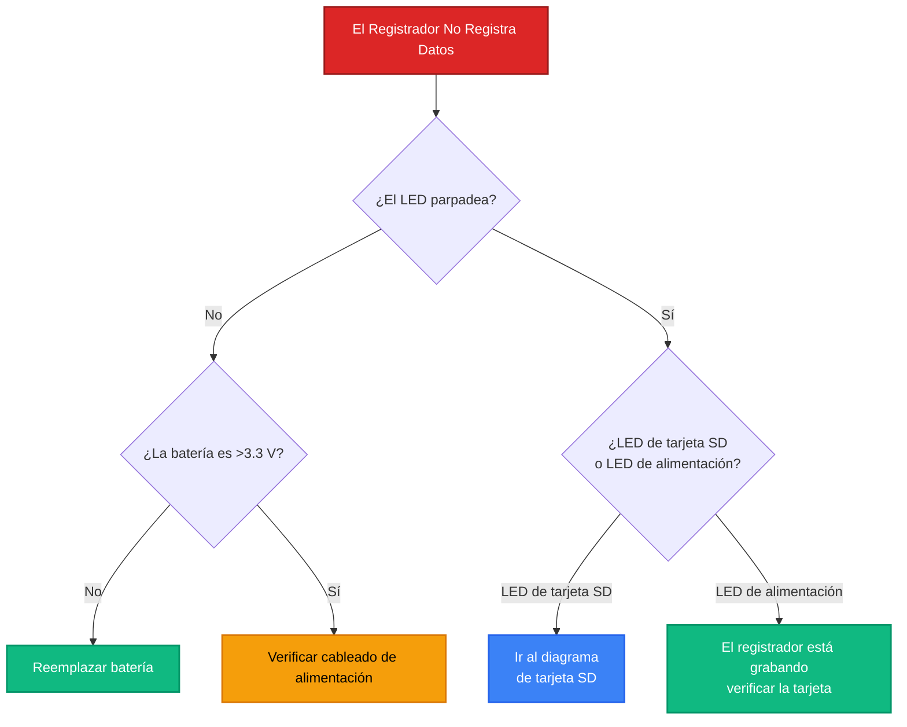
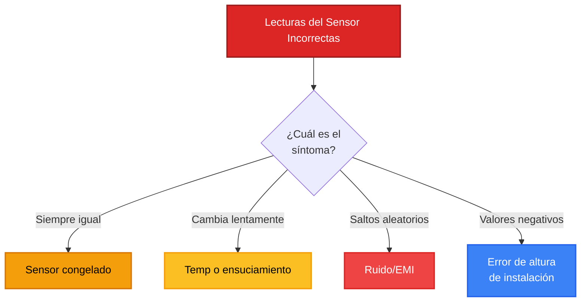
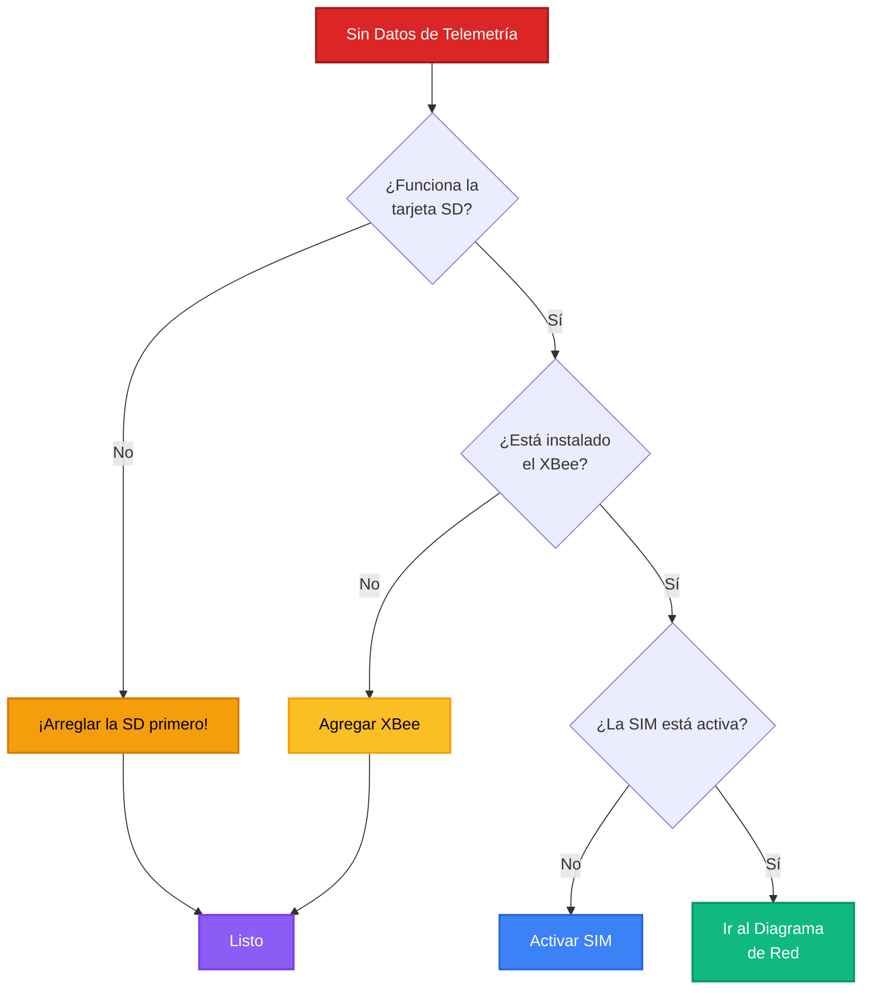
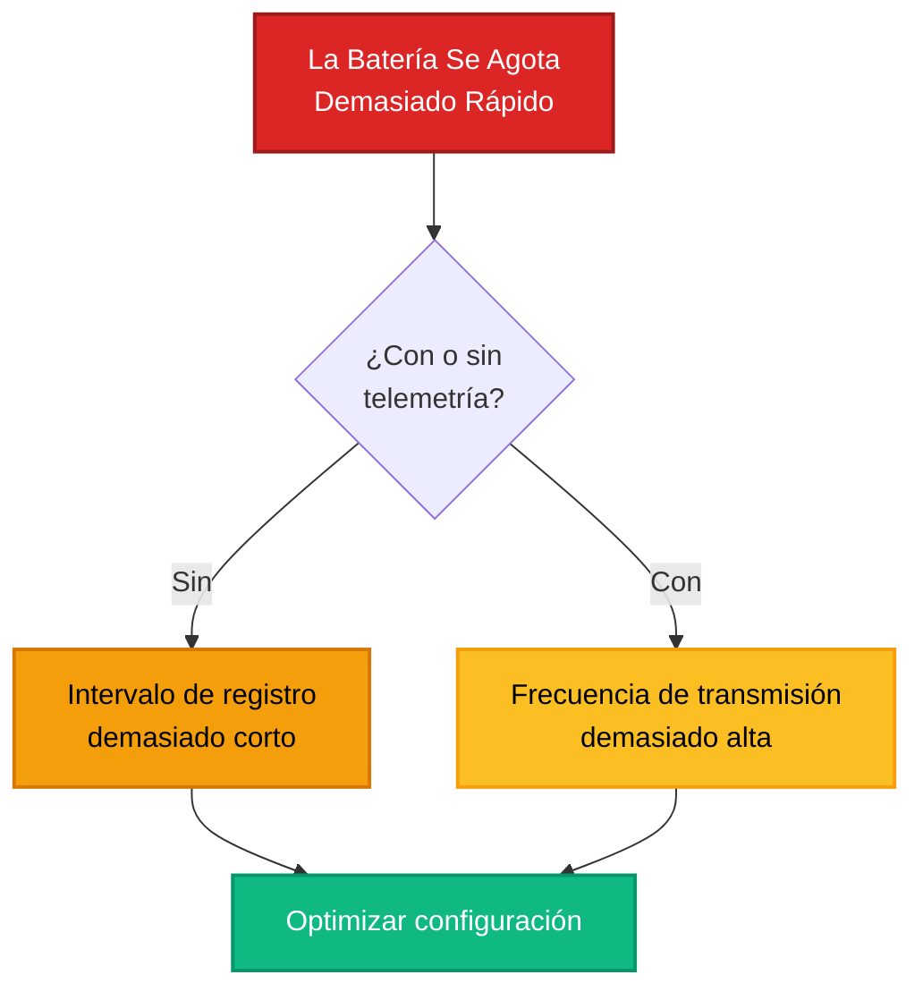
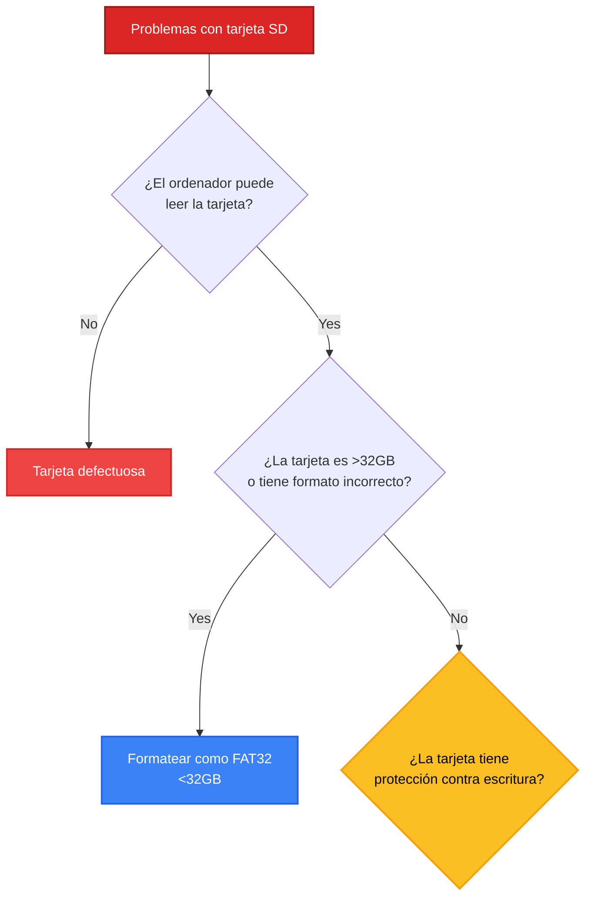

# Diagramas de Diagnóstico

!!! abstract "Resumen"
    Esta página contiene árboles de decisión visuales para diagnosticar problemas comunes en los registradores Riverlabs. Siga el diagrama de flujo desde el síntoma hasta la solución.

## Cómo Usar Estos Diagramas

1. **Identifique su síntoma** de la lista siguiente
2. **Comience desde arriba** del diagrama relevante
3. **Responda las preguntas sí/no** y siga las flechas
4. **Llegue a una solución** o al siguiente paso de diagnóstico
5. **Consulte las referencias** con guías detalladas según sea necesario

---

## Diagrama 1: El Registrador No Registra Datos

### Síntoma
El registrador parece encenderse pero no aparecen nuevos datos en la tarjeta SD.

### Árbol de Decisión Completo

**INICIO: El registrador no registra datos**

**P1: ¿Algún LED parpadea cuando el registrador debería estar midiendo?**

- **Sin actividad del LED** → Ir a P2
- **LED parpadea** → Ir a P5

**P2: ¿El voltaje de la batería es >3.3 V?**

- Medir con multímetro en los terminales de la batería
- **No** (<3.3 V) → **SOLUCIÓN: Reemplazar/cargar la batería**
- **Sí** (≥3.3 V) → Ir a P3

**P3: ¿El interruptor de alimentación está en ON?**

- Verificar la posición física del interruptor
- **No** → **SOLUCIÓN: Encender el interruptor de alimentación**
- **Sí** → Ir a P4

**P4: ¿Las conexiones de la batería están seguras?**

- Inspeccionar el conector JST
- Verificar la polaridad (rojo=+, negro=-)
- **Suelto/desconectado** → **SOLUCIÓN: Reconectar la batería de forma segura**
- **Seguro pero sin alimentación** → **SOLUCIÓN: Verificar el circuito de alimentación del PCB o reemplazar el registrador**

**P5: ¿Qué LED parpadea?**

- **LED de tarjeta SD** → El registrador está funcionando, ir a P6
- **Solo LED de alimentación** → Ir a P7

**P6: ¿La tarjeta SD está insertada?**

- Verificar la presencia física
- **No** → **SOLUCIÓN: Insertar tarjeta SD formateada**
- **Sí** → Ir a P8

**P7: ¿El Monitor Serie muestra mensajes de error?**

- Conectar el cable FTDI, abrir el Monitor Serie a 115200 baudios
- **"SD card init failed"** → Ir a P6
- **"RTC not responding"** → **SOLUCIÓN: Fallo del RTC, verificar las conexiones o reemplazar**
- **"Sensor timeout"** → Ir a P9
- **Sin salida serie** → **SOLUCIÓN: Cargar el firmware correcto**

**P8: ¿La tarjeta SD está formateada correctamente?**

- Retirar la tarjeta, verificar en la computadora
- **No formateada / formato incorrecto** → **SOLUCIÓN: Formatear como FAT32, <32GB**
- **Formateada correctamente** → Ir a P10

**P9: Problema del sensor - ¿qué tipo de sensor?**

- **Ultrasónico (Wari)** → **SOLUCIÓN: Verificar las conexiones del cable del sensor, verificar que el sensor esté alimentado (debería hacer clic)**
- **Lidar** → **SOLUCIÓN: Verificar las conexiones I2C (SDA/SCL), verificar la dirección del sensor 0x62**

**P10: ¿La tarjeta SD tiene un archivo .CSV reciente?**

- Verificar las fechas de los archivos en la tarjeta
- **Archivo reciente presente** → ¡El registrador está grabando! Verificar el nombre/ubicación del archivo
- **Solo archivos antiguos / sin archivos** → Ir a P11

**P11: ¿La hora del RTC está configurada correctamente?**

- Verificar el nombre del archivo .CSV (incluye fecha/hora)
- **Archivos con fecha 2000/01/01** → **SOLUCIÓN: Configurar el RTC con la utilidad `set_clock`**
- **Archivos con fecha correcta** → **SOLUCIÓN: Verificar el intervalo de medición en el código (podría ser muy largo)**

---

## Diagrama 2: Las Lecturas del Sensor Parecen Incorrectas

### Síntoma
El registrador graba datos pero los valores son incorrectos, constantes o erráticos.

### Árbol de Decisión Completo

**INICIO: Las lecturas del sensor parecen incorrectas**

**P1: ¿Cuál es el síntoma?**

- **El valor nunca cambia** → Ir a P2 (sensor congelado)
- **El valor cambia pero parece incorrecto** → Ir a P6 (calibración/instalación)
- **Erráticos/saltos aleatorios** → Ir a P9 (ruido/interferencia)
- **Valores negativos o imposibles** → Ir a P12 (error de configuración)

**P2: SENSOR CONGELADO - ¿El valor cambia en absoluto durante 1 hora?**

- Tomar múltiples lecturas
- **Nunca cambia (p.ej., atascado en 5000 mm)** → Ir a P3
- **Cambia ligeramente** → Ir a P6

**P3: ¿Cuál es el valor constante?**

- **5000 mm o rango máximo** → **SOLUCIÓN: Tiempo de espera del sensor, sin objetivo detectado**
    - Verificar: ¿Objetivo en rango? ¿Haz apuntado correctamente? ¿Sensor funcionando?
- **0 o casi cero** → **SOLUCIÓN: Fallo de hardware del sensor o problema de cableado**
- **Otro valor constante** → Ir a P4

**P4: ¿Tipo de sensor?**

- **Ultrasónico (Wari)** → Ir a P5
- **Lidar** → **SOLUCIÓN: Fallo de comunicación I2C del Lidar, verificar conexiones**

**P5: DIAGNÓSTICO ULTRASÓNICO**

- **¿Puede escuchar clics?** (el sensor debería hacer clic en cada medición)
    - **Sin clics** → **SOLUCIÓN: Sensor sin alimentación, verificar el cable**
    - **Con clics** → **SOLUCIÓN: El sensor transmite pero sin eco (sin objetivo, orientado incorrectamente o el objetivo es demasiado absorbente)**

**P6: INCORRECTO PERO CAMBIANDO - ¿Cuánto están incorrectos los valores?**

- **Desviado por una cantidad constante** (p.ej., siempre 500 mm demasiado alto) → Ir a P7
- **Cambia durante días/semanas** → Ir a P8
- **Valores demasiado altos o bajos** → Ir a P7

**P7: ¿La altura de instalación está configurada correctamente?**

- Verificar: ¿Los valores tienen sentido físico?
- **Ejemplo:** Sensor a 3000 mm sobre el agua, lee 1500 mm → profundidad del agua = 3000 - 1500 = 1500 mm
    - ¿Coincide con la realidad?
- **Altura incorrecta en la interpretación de datos** → **SOLUCIÓN: Corregir la altura de instalación en el análisis**
- **Altura correcta pero los valores siguen siendo incorrectos** → Ir a P8

**P8: ¿Obstrucción física o ensuciamiento?**

- Inspeccionar la cara del sensor
- **Telarañas, insectos, suciedad** → **SOLUCIÓN: Limpiar el sensor**
- **Hielo/escarcha (invierno)** → **SOLUCIÓN: Hielo en el sensor, esperar el deshielo o reubicar**
- **Vegetación crecida en el trayecto del haz** → **SOLUCIÓN: Podar la vegetación**
- **Limpio y despejado** → **SOLUCIÓN: El sensor puede estar fallando, reemplazar o verificar la compensación de temperatura (Wari)**

**P9: LECTURAS ERRÁTICAS - ¿Hay un patrón en el ruido?**

- Observar los datos a lo largo del tiempo
- **Picos aleatorios** → Ir a P10
- **Patrón regular (p.ej., cada noche)** → Ir a P11

**P10: Diagnóstico de picos aleatorios**

- **Picos muy cortos (1–2 muestras)** → **SOLUCIÓN: EMI/ruido eléctrico**
    - Verificar: ¿Fuente de alimentación limpia? ¿Motores/bombas cercanas?
    - Arreglo: Agregar condensadores de filtrado, aislar la alimentación, mover el registrador
- **Picos más largos (minutos–horas)** → **SOLUCIÓN: Interferencia física (pájaro, escombros)**
    - Arreglo: Revisar la instalación, agregar barreras físicas

**P11: Diagnóstico de patrón regular**

- **El patrón coincide con el ciclo de temperatura** → **SOLUCIÓN: La temperatura afecta al sensor (normal para ultrasónico)**
    - Nota: Wari mide la temperatura para compensación, pero no es perfecta
- **El patrón coincide con la luz solar** → **SOLUCIÓN: Expansión térmica del montaje o la estructura**
- **El patrón coincide con mareas/lluvia aguas arriba** → ¡Esto es real! No es un error.

**P12: VALORES NEGATIVOS O IMPOSIBLES**

- **Distancia negativa** → **SOLUCIÓN: Error matemático en el código o el procesamiento de datos**
    - Verificar: ¿Altura de instalación configurada? ¿Unidades consistentes (mm vs. cm)?
- **Distancia > altura de instalación** → **SOLUCIÓN: El sensor apunta al suelo/obstrucción en lugar de al agua**
    - Arreglo: Reorientar el sensor
- **Distancia > rango máximo del sensor** → **SOLUCIÓN: Objetivo fuera de rango, aumentar la altura o usar lidar**

---

## Diagrama 3: Sin Datos de Telemetría

### Síntoma
El registrador graba en la tarjeta SD pero ThingsBoard no recibe datos.

### Árbol de Decisión Completo

**INICIO: No se reciben datos de telemetría**

**P1: ¿El registrador graba datos en la tarjeta SD correctamente?**

- Verificar: ¿Archivo .CSV reciente con datos?
- **No** → **SOLUCIÓN: Arreglar primero el registro en la tarjeta SD** (usar el Diagrama 1)
- **Sí** → Ir a P2

**P2: ¿El módulo XBee está instalado físicamente?**

- Inspección visual del PCB del registrador
- **Sin XBee presente** → **SOLUCIÓN: Este registrador no tiene capacidad de telemetría**
    - Opciones: Agregar módulo XBee, o recuperar manualmente los datos de la tarjeta SD
- **XBee instalado** → Ir a P3

**P3: ¿La tarjeta SIM está insertada en el XBee?**

- Verificar: Ranura de SIM en la parte inferior del XBee
- **Sin SIM** → **SOLUCIÓN: Insertar tarjeta SIM activada** (¡apagar primero!)
- **SIM presente** → Ir a P4

**P4: ¿La SIM está activada con el operador?**

- Prueba: Insertar la SIM en un teléfono, verificar el servicio
- **Sin servicio en el teléfono** → **SOLUCIÓN: Contactar al operador para activar**
- **La SIM funciona en el teléfono** → Ir a P5

**P5: ¿El voltaje de la batería es suficiente?**

- Verificar: Voltaje >3.5 V (la telemetría requiere más energía que solo SD)
- **<3.5 V** → **SOLUCIÓN: Cargar/reemplazar la batería, volver a probar**
- **≥3.5 V** → Ir a P6

**P6: ¿El Monitor Serie muestra intentos de conexión de red?**

- Conectar FTDI, verificar la salida de depuración
- **Sin mención de XBee/red** → Ir a P7
- **Muestra "Connecting to network..."** → Ir a P8

**P7: Problema de comunicación del XBee**

- **El serie muestra "XBee timeout"** → **SOLUCIÓN: Verificar la conexión física del XBee (pines asentados)**
- **Sin mensajes del XBee en absoluto** → **SOLUCIÓN: Verificar que el código de Arduino tenga la telemetría habilitada**

**P8: ¿Qué estado de red aparece?**

- **"Network registered"** → Ir a P10 (conectado pero fallo de transmisión)
- **"Searching..."** para siempre → Ir a P9
- **"Connection failed"** → Ir a P9

**P9: Fallo de conexión de red**

- Verificar la intensidad de la señal en la ubicación (probar con el teléfono)
- **Sin señal celular** → **SOLUCIÓN: Mover el registrador a una ubicación con cobertura, o usar una antena externa**
- **El teléfono tiene señal** → Ir a P11 (problema de configuración del XBee)

**P10: Red conectada pero sin datos**

- ¿El serie muestra: "HTTP POST: 200 OK"?
- **Sí, muestra 200 OK** → Ir a P13 (servidor recibiendo pero no mostrando)
- **No, muestra código de error** → Ir a P12 (fallo de transmisión)
- **Sin intento de transmisión** → **SOLUCIÓN: Verificar la configuración de TELEMETRY_INTERVAL (podría ser demasiado largo)**

**P11: Verificación de la configuración del XBee**

- Conectar el XBee a XBee Studio
- **¿APN correcto?** → Si no: **SOLUCIÓN: Configurar el APN correcto**
- **¿Modo API = 2?** → Si no: **SOLUCIÓN: Establecer AP=2** (¡crítico!)
- **¿Tecnología de red (NT) coincide con el operador?** → Probar NT=0 vs NT=1
- **Todos los ajustes correctos** → **SOLUCIÓN: Verificar la cuenta del operador (¿plan de datos activo? ¿ICCID registrado?)**

**P12: Códigos de error de transmisión**

- **400 Bad Request** → **SOLUCIÓN: Error de formato JSON, verificar el código de Arduino**
- **401 Unauthorized** → **SOLUCIÓN: Token de acceso incorrecto, verificar en ThingsBoard**
- **404 Not Found** → **SOLUCIÓN: URL del servidor incorrecta en el código de Arduino**
- **Timeout** → **SOLUCIÓN: Problema de red, verificar la intensidad de la señal, intentar reducir el tamaño del payload**

**P13: El servidor recibe datos pero el panel no los muestra**

- **Verificar la pestaña "Latest Telemetry"** del dispositivo en ThingsBoard
    - **Los datos aparecen allí** → **SOLUCIÓN: El widget del panel está mal configurado** (verificar que las claves de datos coincidan)
    - **Tampoco hay datos allí** → **SOLUCIÓN: Token de dispositivo incorrecto o dispositivo inactivo**

---

## Diagrama 4: La Batería Se Agota Demasiado Rápido

### Síntoma
El voltaje de la batería cae más rápido de lo esperado.

### Árbol de Decisión Completo

**INICIO: La batería se agota demasiado rápido**

**P1: ¿El registrador tiene telemetría (XBee instalado)?**

- **Sin telemetría** → Ir a P2 (configuración solo con SD)
- **Con telemetría** → Ir a P6 (configuración de telemetría)

**P2: REGISTRADOR SOLO SD - ¿Cuál es el intervalo de registro?**

- Verificar el código: intervalo de medición
- **<5 minutos** → Ir a P3
- **≥5 minutos** → Ir a P4

**P3: Registro de alta frecuencia**

- **¿Necesita mediciones con tanta frecuencia?**
    - **Sí (p.ej., registro de eventos)** → **SOLUCIÓN: Drenaje alto normal. Usar batería más grande o solar.**
    - **No** → **SOLUCIÓN: Aumentar el intervalo de registro a 15 minutos**
- **Vida útil de la batería esperada:**
    - Intervalo de 1 min: ~7 días
    - Intervalo de 5 min: ~15 días
    - Intervalo de 15 min: ~30–60 días

**P4: Intervalo de registro razonable pero la batería sigue agotándose rápido**

- **¿Tipo de sensor?**
    - **Lidar** → Ir a P5 (el lidar consume más energía)
    - **Ultrasónico** → **SOLUCIÓN: Posible componente defectuoso, verificar si hay calor (¿regulador fallando?)**

**P5: Consumo de energía del Lidar**

- **Vida útil esperada de la batería del lidar:** ~15–30 días (registro de 15 min, 3.7 V 2600 mAh)
- **¿La vida real es mucho más corta (< 1 semana)?**
    - **SOLUCIÓN: Verificar problemas de firmware (sensor no durmiendo), o cortocircuito de hardware**
- **Vida 10–15 días** → Normal para lidar

**P6: REGISTRADOR CON TELEMETRÍA - ¿Frecuencia de transmisión?**

- Verificar el código: TELEMETRY_INTERVAL
- **Cada medición** → **SOLUCIÓN: ¡Demasiado frecuente! Establecer cada 4–12 mediciones**
- **Cada 4–12 mediciones** → Ir a P7 (razonable, pero verificar otros factores)
- **Diario o menos** → Ir a P8 (muy poco frecuente, el problema está en otra parte)

**P7: Intervalo de telemetría razonable pero agotamiento rápido**

- **Verificar la intensidad de la señal:**
    - **RSSI < -100 dBm (señal débil)** → **SOLUCIÓN: La señal débil hace que el XBee transmita con mayor potencia**
        - Arreglo: Antena externa, reubicar el registrador o aumentar el intervalo
    - **RSSI > -100 dBm (buena señal)** → Ir a P8

**P8: Otros consumos de energía**

- **¿El XBee entra en modo de suspensión entre transmisiones?**
    - Comprobar configuración XBee: SM=1 (suspensión por pin)
    - **SM=0 (sin suspensión)** → **SOLUCIÓN: Configurar SM=1**
- **¿Hay fallos de transmisión con reintentos?**
    - Revisar el registro serie: ¿muchos intentos fallidos?
    - **Muchos fallos** → **SOLUCIÓN: Corregir problemas de red, reducir los intentos de reintento**
- **Todas las configuraciones óptimas** → Ir a P9

**P9: Comprobación del estado de la batería**

- **¿La batería es antigua o está dañada?**
    - ¿Tiene más de 2 años?
    - ¿La batería se calienta durante la carga?
    - ¿Capacidad degradada?
    - **SOLUCIÓN: Reemplazar la batería** (las baterías LiPo se degradan con el tiempo)
- **Batería nueva y en buen estado** → Ir a P10

**P10: Diagnóstico de fallos de hardware**

- **Medir la corriente con un amperímetro:**
    - Modo de suspensión: Debe ser <1 mA
    - Activo (midiendo): <50 mA (ultrasónico) o <100 mA (lidar)
    - Transmitiendo: ~200 mA
- **¿La corriente es mucho mayor de lo esperado?**
    - **SOLUCIÓN: Fallo de hardware (cortocircuito, componente defectuoso)**
    - Requiere: inspección de la PCB, prueba de componentes o sustitución del registrador

---

## Diagrama de flujo 5: Problemas con la tarjeta SD

### Síntoma
La tarjeta SD no se inicializa, los datos están corruptos o hay errores en el sistema de archivos.

### Árbol de decisiones completo

**INICIO: Problemas con la tarjeta SD**

**P1: ¿Está la tarjeta SD físicamente insertada?**

- Comprobación visual
- **No** → **SOLUCIÓN: Insertar la tarjeta SD en el slot hasta que haga clic**
- **Sí** → Ir a P2

**P2: ¿Puede el ordenador leer la tarjeta?**

- Retirar la tarjeta, insertarla en el ordenador (con adaptador si es necesario)
- **El ordenador no puede leer la tarjeta** → Ir a P3 (tarjeta defectuosa)
- **El ordenador lee la tarjeta** → Ir a P5 (problema específico del registrador)

**P3: TARJETA DEFECTUOSA - ¿El ordenador solicita formatear?**

- **"Disco no inicializado" o similar**
    - **SOLUCIÓN: Formatear la tarjeta** (FAT32, unidad de asignación de 32 KB)
    - Si el formato falla → Tarjeta físicamente dañada, reemplazar
- **El ordenador no detecta la tarjeta en absoluto**
    - **SOLUCIÓN: Tarjeta muerta, reemplazar**

**P4: Después de formatear, ¿funciona el registrador?**

- **Sí** → ¡Resuelto! (La tarjeta estaba corrupta)
- **No** → Ir a P5

**P5: EL ORDENADOR LEE LA TARJETA - ¿Capacidad de la tarjeta?**

- Comprobar propiedades
- **>32 GB** → **SOLUCIÓN: Tarjeta demasiado grande, usar ≤32 GB**
- **≤32 GB** → Ir a P6

**P6: ¿Formato del sistema de archivos de la tarjeta?**

- Comprobar: FAT32, exFAT, NTFS?
- **No es FAT32** → **SOLUCIÓN: Formatear como FAT32**
- **Es FAT32** → Ir a P7

**P7: ¿La tarjeta tiene archivos .CSV existentes?**

- **Sin archivos** → Ir a P8 (nunca funcionó)
- **Tiene archivos** → Ir a P9 (funcionaba, ahora paró)

**P8: NUNCA FUNCIONÓ - ¿La tarjeta tiene protección contra escritura?**

- Comprobar el interruptor físico en el lateral de la tarjeta SD
- **Interruptor en posición "Lock"** → **SOLUCIÓN: Deslizar el interruptor para desbloquear**
- **No bloqueado** → Ir a P10 (problema en el slot SD del registrador)

**P9: FUNCIONABA - ¿Cuándo dejó de funcionar?**

- Comprobar la fecha del último archivo
- **Paró cuando la tarjeta estaba llena** → **SOLUCIÓN: Tarjeta llena, eliminar archivos antiguos o usar una tarjeta más grande**
- **Paró aleatoriamente** → Ir a P11 (corrupción)

**P10: Problema en el slot SD del registrador**

- **¿La tarjeta SD hace contacto?**
    - Probar: Reinsertar la tarjeta, asegurarse de que esté completamente encajada
    - Probar: Una tarjeta diferente (que funcione correctamente)
    - **Otras tarjetas tampoco funcionan** → **SOLUCIÓN: Fallo de hardware en el slot SD, reparar o reemplazar el registrador**
    - **Otras tarjetas funcionan** → Tarjeta original incompatible, usar otra marca

**P11: Resolución de problemas de corrupción de datos**

- **¿Hay un patrón en la corrupción?**
    - Después de un evento específico (corte de alimentación, batería agotada, tarjeta retirada con el registrador en marcha)
- **SOLUCIÓN: Corrupción por apagado incorrecto**
    - Solución: Apagar siempre el registrador antes de retirar la tarjeta
    - Prevención: Implementar apagado seguro en el código (volcar buffers, cerrar archivos)
- **Corrupción aleatoria:**
    - **SOLUCIÓN: Problema de calidad de la tarjeta, usar SanDisk/Samsung/Kingston (evitar marcas genéricas)**

---

## Uso eficaz de estos diagramas de flujo

### Consejos

1. **Imprimir y plastificar** para uso en campo
2. **Seguir sistemáticamente**: no saltarse pasos
3. **Documentar el recorrido**: anotar qué ramas se siguieron
4. **Consultar** las guías detalladas para las soluciones
5. **¿Varios problemas?** Usar varios diagramas de flujo

### Cuando los diagramas de flujo no resuelven el problema

Si has seguido el diagrama de flujo correspondiente y el problema persiste:

1. **Revisar [Problemas comunes](common-issues.md)**: Síntomas similares con explicaciones detalladas
2. **Consultar las [FAQ](faq.md)**: Casos especiales y situaciones inusuales
3. **Contactar con soporte** indicando:
    - Ruta seguida en el diagrama de flujo
    - Resultados del diagnóstico
    - Registros del Monitor Serie
    - Fotos del hardware

---

## Próximos Pasos

- 📋 [Problemas comunes](common-issues.md): Descripciones detalladas de problemas y soluciones
- ❓ [FAQ](faq.md): Preguntas frecuentes
- 🔧 [Mantenimiento de hardware](../hardware/maintenance.md): Mantenimiento preventivo
- 🚨 [Resolución de problemas de telemetría](../../telemetry/troubleshooting-connections.md): Diagnóstico detallado de telemetría

---

!!! tip "Resolución de problemas visual"
    Estos diagramas de flujo proporcionan un camino sistemático desde el síntoma hasta la solución. ¡Téngalos a mano en el campo!
