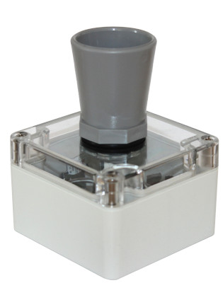

## Introduction

The Riverlabs loggers are a series of low-cost environmental loggers based on the Arduino bootloader. This makes them easy to program using with a PC without the need for additional hardware (except for an FTDI cable) or propriety software. It also provides the flexibility to extend and alter them to fit specific applications and workflow.

## Overview and specifications

<div class="row">
    <div class="col-md-6">
        <center>
        <h3>Wari</h3>
        
        </center>
        <ul>
        <li>Maxbotix MB7389 Ultrasound sensor</li>
        <li>0.3m - 5m range, 1mm resolution</li>
        <li>Atmel Atmega328 CPU</li>
        <li>Arduino Pro Mini bootloader</li>
        </ul>
    </div>
    <div class="col-md-6">
        <center>
        <h3>Lidar</h3>
        
        </center>
        <ul>
        <li>Garmin Lidarlite v3HP sensor</li>
        <li>0.05 - 35m range, 1cm resulution</li>
        <li>Atmel Atmega328 CPU</li>
        <li> Arduino Pro Mini bootloader</li>
        </ul>
    </div>
</div>

## Power considerations

The logger requires two batteries. It uses a 3.7V 18650 lithium battery as main power source. This is a commonly available battery that can be found in may electronic stores. They are typically rechargeable batteries, with a capacity of around 2000 mAh. Meake sure that you purchase an appropriate charger. They cannot be charged with Ni-MH chargers!

Also mind the polarity when inserting the battery. The logger versions without solar charging circuit are protected for wrong insertion of the battery, but those with solar charging circuit are not. Inserting the battery wrongly will cause permanent damage those loggers and may cause fire.

In addition to the main battery, the circuit board also has a slot for a small CR1220 coin battery, which serves as backup for the real-time clock. You can run the logger without this battery; however in that case the logger will lose the time when the main battery is removed.

## Programming the loggers

The loggers can be programmed with any Arduino compatible IDE, but the instructions here use the official Arduino IDE. For the Atmel-based loggers, you will need an FTDI cable or adapter, as they do not come with an USB port for cost-saving reasons.

On first use of the logger, you will need to set the clock with the set_clock.ino script. This only has to be done once, except if both batteries are removed or have run out. When using telemetry, the clock needs to be set to the UTC time zone.

The main script of the logger is wari.ino. The main settings, such as logging and telemetry frequency, can be found at the start of the script. Set them as you like, but be aware that the frequency of logging and telemetry may affect battery life.

## Telemetry

The loggers use a DIGI XBee 3G cellular modem, and transmit via the COAP protocol (MQTT is under development). You will need to set up a COAP server such as Thingsboard to receive the data.

For deployment in the logger, the XBee needs to be configured to use API mode (with escapes). If you purchased your loggers through Riverlabs, then this is already done. However, if you ever need to do this yourself, you need to use the DIGI's free XCTU software, together with an FTDI cable or adapter. The crucial settings are as follows:

```
BD: 9600
NB: no parity
SB: one stop bit
RO: 3
TD: 0
FT: 681
AP: API mode with escapes
SM: pin sleep [1]
```

Setting these incorrectly may prevent the logger from communicating with the XBee.



