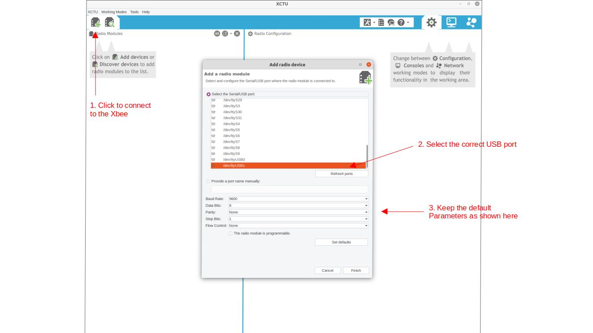
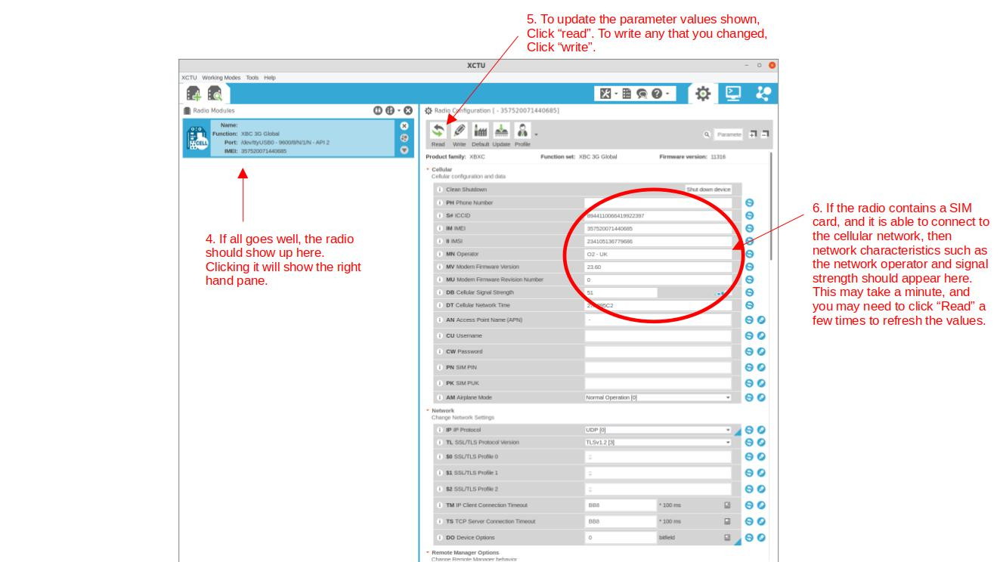

## Key settings

### Serial interfacing:

```
BD: 9600
NB: no parity
SB: one stop bit
RO: 3
TD: 0
FT: 681
AP: API mode with escapes
```

### Sleep commands:

```
SM: pin sleep [1]
```

## XBee radios

The WMOnode loggers come with an xbee socket, which can be used for DIGI XBee compatible radios. 

The Digi XBees are a series of popular radio devices for embedded applications. The XBee range covers many different radio technologies and protocols such as Zigbee. This makes it gives a large flexibility when designing network solutions for particular applications, both wide and local networks, and to upgrade devices. In addition to being extremely solid and reliable pieces of kit, they integrate nicely with Arduino thanks to the xbee-arduino library. We have extended the [original library](https://github.com/andrewrapp/xbee-arduino) with the functionality required to interact with the newer cellular modems, which use a slightly extended version of the original API. Our version is available on our [github page](https://github.com/ICHydro/xbee-arduino) but is also already included in the WMOnode package on this github page, so you do not need to install it separately.

For telemetry via the cellular network, we use the [DIGI XBee Cellular 3G](https://www.digi.com/products/embedded-systems/digi-xbee/cellular-modems/digi-xbee-cellular-3g). Digi also has solutions for 4G, but these rely on the LTE-M or NB-IoT protocols, both of which are not very common yet. It should be straightforward to upgrade, however this guide focuses on the 3G modem.

Most of the configuration of the Cellular XBee is done directly in the Arduino code. However you need to set some parameters manually to ensure that the logger is able to communicate with the XBee. This can be done most easily with DIGI's free [XCTU software](https://www.digi.com/products/embedded-systems/digi-xbee/digi-xbee-tools/xctu). We provide a short overview here, but to explore the full functionality of the XCTU software, we refer to the [original manual](https://www.digi.com/products/embedded-systems/digi-xbee/digi-xbee-tools/xctu).


## Programming an Xbee with XCTU

### Connecting the XBee to your computer

Xbee devices come with a few different digital interfaces, including UART and SPI. The UART serial interface is most convenient to work with, and is also what Riverlabs loggers use. The Xbee can be programmed fully via Arduino code, but it is more convenient to program it first by connecting it directly to a computer.

Digi sells a development board, the [XBIB](https://www.digi.com/products/models/xbib-u-dev), which comes with all bells and whistles and its use is described in the Xbee manual. However, any USB-to-serial adapter can be used and many adapters exist. Most of those are based on the FTDI chip, such as the [Sparkfun Xbee Explorer](https://www.sparkfun.com/products/11812). You may need to install the FTDI drivers if you use Windows, or set some permissions to be set on Linux. Sparkfun has a [great manual](https://learn.sparkfun.com/tutorials/how-to-install-ftdi-drivers/all) if you experience problems with your PC not recognizing the serial adapter.

It is also important to note that FTDI adapters typically come as either 3.3V and 5V versions. XBees are strictly 3.3V devices so you should never use 5V FTDI adapters or you may damage your Xbee. Some adaptors have a switch to set the voltage. In that case, make sure that it is set correctly.

[Photo of Xbee connected via FTDI adapter]

### Using the XCTU software

It is most convenient to use Digi’s XCTU software to program an XBee via a PC. XCTU can be downloaded for free from teh [Digi website](https://www.digi.com/products/embedded-systems/digi-xbee/digi-xbee-tools/xctu). 

XCTU is also well documented in the user manual, so here we focus only on the steps that are relevant for operating the Riverlabs loggers. The main steps to connect to the Xbee are outlined in Figures 2 and 3.






