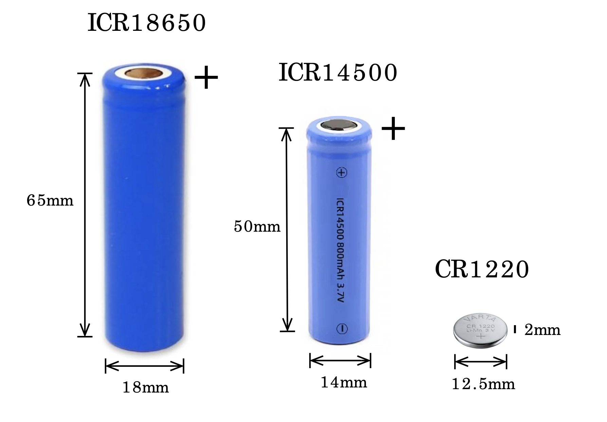

# Battery & Power Guide

!!! abstract "Overview"
    Understanding battery behavior and power management is essential for reliable field deployments. This guide covers battery selection, voltage interpretation.

## Battery System Overview

Riverlabs loggers use a dual-battery system for power and timekeeping.


### Main Power: 18650 or 14500 Battery

Riverlabs loggers support two battery sizes with two chemistry options:

| Battery Type | Chemistry | Nominal Voltage | Capacity | Form Factor | Notes |
|--------------|-----------|----------------|----------|-------------|-------|
| **18650** | LiPo (Lithium Polymer) | 3.7V | 2000-3000 mAh | 18mm × 65mm | Most common, high capacity |
| **18650** | LiFePO4 (Lithium Iron Phosphate) | 3.2V | 1500-2000 mAh | 18mm × 65mm | Safer, longer cycle life, lower voltage |
| **14500** | LiPo (Lithium Polymer) | 3.7V | 600-800 mAh | 14mm × 50mm | Smaller, lower capacity |
| **14500** | LiFePO4 (Lithium Iron Phosphate) | 3.2V | 400-600 mAh | 14mm × 50mm | Safer, smaller form factor |


*18650 and 14500 battery sizes with LiPo and LiFePO4 chemistry options*

**Chemistry Comparison:**

| Feature | LiPo (3.7V) | LiFePO4 (3.2V) |
|---------|-------------|----------------|
| **Voltage Range** | 4.2V (full) - 3.0V (empty) | 3.65V (full) - 2.5V (empty) |
| **Energy Density** | Higher | Lower |
| **Safety** | Good (with protection) | Excellent (very stable) |
| **Cycle Life** | 300-500 cycles | 2000+ cycles |
| **Temperature Tolerance** | -20°C to 60°C | -20°C to 60°C |
| **Cost** | Lower | Slightly higher |
| **Best For** | Maximum runtime | Long-term reliability, safety |

**Critical Safety Information:**

!!! danger "Battery Safety"
    - ⚠️ Never use damaged or dented batteries
    - ⚠️ Check polarity before insertion
    - ⚠️ Do not charge below 0°C
    - ⚠️ Do not expose to heat >60°C
    - ⚠️ Replace if swollen or leaking
    - ⚠️ Dispose properly (battery recycling)

### Backup Battery: CR1220 Coin Cell

**Specifications:**
- **Type:** CR1220 Lithium coin cell (non-rechargeable)
- **Nominal Voltage:** 3.0V
- **Capacity:** ~40 mAh
- **Purpose:** Real-time clock backup only
- **Lifespan:** 5-10 years typical

**Function:**
- Maintains clock time when main battery removed
- Does NOT power logger or sensor
- Logger operates without it (but loses time)
- Essential for telemetry applications (UTC time)

---

## Battery Voltage Interpretation

Understanding battery voltage helps predict remaining life and identify issues.

### Voltage vs. State of Charge

Battery voltage indicates remaining capacity, but the voltage ranges differ between LiPo and LiFePO4:

#### LiPo (3.7V Nominal) Batteries

| Voltage | State of Charge | Status | Action |
|---------|----------------|--------|--------|
| **4.20V** | 100% | Fresh/Fully Charged | Optimal |
| **4.10V** | ~95% | Excellent | Normal operation |
| **4.00V** | ~85% | Very Good | Normal operation |
| **3.90V** | ~75% | Good | Normal operation |
| **3.80V** | ~60% | Fair | Monitor |
| **3.70V** | ~45% | Nominal | Plan replacement |
| **3.60V** | ~30% | Low | Replace soon |
| **3.50V** | ~20% | Very Low | Replace immediately |
| **3.40V** | ~10% | Critical | **Replace now** |
| **3.30V** | ~5% | Emergency | **Imminent failure** |
| **3.00V** | 0% | Depleted | Logger may stop |
| **<3.00V** | Over-discharged | Damaged | Battery may be ruined |

#### LiFePO4 (3.2V Nominal) Batteries

| Voltage | State of Charge | Status | Action |
|---------|----------------|--------|--------|
| **3.65V** | 100% | Fresh/Fully Charged | Optimal |
| **3.40V** | ~95% | Excellent | Normal operation |
| **3.30V** | ~75% | Very Good | Normal operation |
| **3.25V** | ~50% | Good | Normal operation |
| **3.20V** | ~40% | Fair | Monitor |
| **3.10V** | ~20% | Low | Replace soon |
| **3.00V** | ~10% | Very Low | Replace immediately |
| **2.90V** | ~5% | Critical | **Replace now** |
| **2.70V** | ~2% | Emergency | **Imminent failure** |
| **2.50V** | 0% | Depleted | Logger will stop |
| **<2.50V** | Over-discharged | Damaged | Battery may be ruined |

!!! info "Flatter Discharge Curve"
    LiFePO4 batteries maintain voltage more consistently throughout discharge. They stay around 3.2-3.3V for most of their capacity, then drop quickly when depleted.


*Typical 18650 discharge curve under logger load*

### Reading Battery Voltage

**From Logger Data:**
- Voltage recorded with each measurement
- Typically last column in data file
- Value in millivolts (e.g., 3850 = 3.85V)

**Example Data Line:**
```
2025/12/27 14:30:00, 1250, 1248, 1252, 1249, 1251, 1250, 1248, 1251, 1249, 1250, 3850
                                                                                      ^^^^
                                                                                Battery voltage (mV)
```

**With Multimeter:**
1. Set multimeter to DC voltage
2. Access battery terminals (may require opening logger)
3. Red probe to + terminal
4. Black probe to - terminal
5. Read voltage (should show 3.0-4.2V)

!!! tip "Voltage Sag During Measurement"
    Voltage drops briefly during active measurement due to high current draw. The logged voltage is typically measured during sleep (more accurate for capacity estimation).

!!! info "First Reading May Be Low"
    On some loggers, the first voltage reading after power-on may appear lower than subsequent readings. This occurs because the measurement circuit capacitors have not fully charged yet. Subsequent readings will show the correct voltage once the circuit has stabilized (typically after the second or third measurement).

---


## Solar Charging

### Solar Panel Specifications

**Typical Solar Setup:**
- Panel: 5-10W, 6V
- Charge Controller: 3.7V Li-ion compatible
- Cable: Weatherproof, strain relief
- Mounting: Adjustable for sun angle

!!! warning "Solar Charging Limitations"
    - Only charges above 0°C
    - Requires good sun exposure, not suitable for heavily shaded locations
    - May not keep up with telemetry use


---

## Battery Storage

### Long-Term Storage

**Optimal Storage Conditions:**
- **Voltage:** 3.7-3.8V for LiPo (50% charge) or 3.2-3.3V for LiFePO4
- **Temperature:** 15-20°C
- **Humidity:** <60%
- **Location:** Cool, dry, away from metal objects

**Storage Duration:**

**LiPo Batteries:**

| Voltage at Storage | Time to Self-Discharge to 3.0V |
|-------------------|--------------------------------|
| 4.2V (full) | ~12-18 months |
| 3.8V (50%) | 18-24 months |
| 3.4V (low) | 6-12 months |

**LiFePO4 Batteries:**

| Voltage at Storage | Time to Self-Discharge to 2.5V |
|-------------------|--------------------------------|
| 3.65V (full) | ~18-24 months |
| 3.2V (50%) | 24-36 months |
| 2.9V (low) | 12-18 months |

!!! warning "Check Stored Batteries"
    Batteries in storage should be checked every 3-6 months. 
    
    - **LiPo:** Recharge to 3.7-3.8V if below 3.4V
    - **LiFePO4:** Recharge to 3.2-3.3V if below 2.9V

### Disposal

**Never throw batteries in regular trash!**

**Proper Disposal:**
1. Discharge to < 3.0V (use in logger until depleted)
2. Tape terminals with electrical tape
3. Take to battery recycling center
4. Many retailers accept 18650 batteries for recycling
5. Check local hazardous waste facilities

---

## Troubleshooting Power Issues

### Logg Won't Power On

**Check:**
1. Battery voltage > 3.0V
2. Battery polarity correct
3. Battery contacts clean and making contact
4. No physical damage to logger
5. Try known-good battery

### Rapid Battery Drain

**Possible Causes:**

| Symptom | Likely Cause | Solution |
|---------|--------------|----------|
| New battery drains in days | Excessive telemetry or failure to enter sleep modde | Reduce telemetry frequency and Re-upload firmware |
| Gradual worsening | Battery aging | Replace battery |


### Voltage Reading Errors

**Inconsistent Voltage Readings:**
- Poor contact: Clean terminals
- Code issue: Re-upload firmware
- Battery dying: Replace

**No Voltage Logged:**
- Check data file format
- Verify voltage measurement in code
- Test ADC with multimeter


---


## Summary Checklist

**For Optimal Battery Performance:**

- [ ] Use quality, 18650 cells
- [ ] Start with 4.0V+ charged battery
- [ ] Install CR1220 backup for clock
- [ ] Reduce telemetry frequency if possible
- [ ] Monitor voltage trends
- [ ] Plan replacement at 3.6V
- [ ] Store spare batteries properly
- [ ] Document all battery changes

---

## Next Steps

- 🔧 [Internal Components](internal-components.md) - Understanding your logger's hardware
- 🛠️ [Maintenance Guide](maintenance.md) - Regular upkeep procedures
- 📊 [ThingsBoard](../telemetry/thingsboard-configuration.md) - Monitor battery voltage remotely
- 🚨 [Troubleshooting](../troubleshooting/common-issues.md) - Power-related issues

---

!!! success "Power Management Mastered"
    With proper battery selection, monitoring, and optimization, your logger deployments can achieve reliable operation for weeks to months on a single battery charge.
