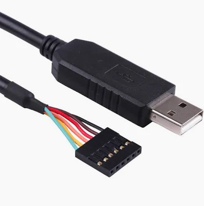
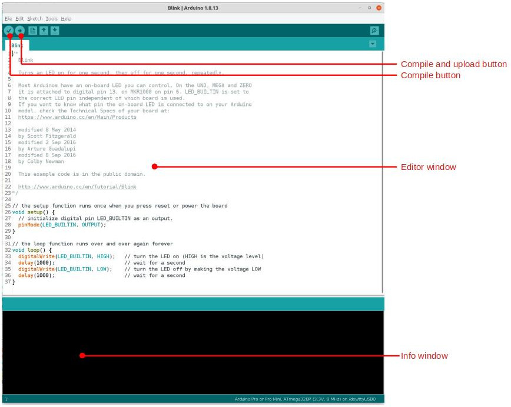
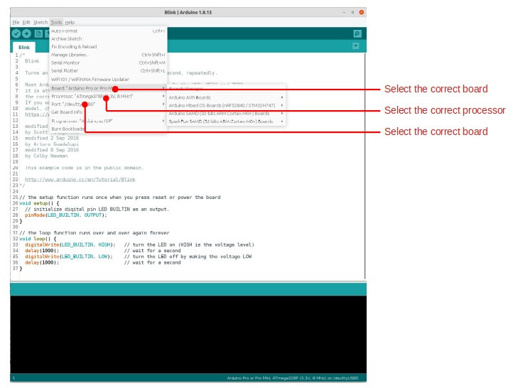

# Arduino Setup Guide

This guide will help you set up the Arduino IDE and prepare your computer for programming your Riverlabs logger.

## What is Arduino?

[Arduino](https://www.arduino.cc/) is a fantastic open source hardware ecosystem centered around the Arduino IDE - a user-friendly software development environment for writing code that runs on embedded processors like those in Riverlabs loggers.

The Arduino team developed a special bootloader that allows you to connect Arduino-compatible boards to your computer without needing specialized hardware programmers. Your Riverlabs logger comes with this bootloader pre-installed.

!!! tip "New to Arduino?"
    If you want to learn more about Arduino, consider buying one of the many Arduino boards from [Arduino.cc](https://www.arduino.cc/en/Main/Products), Sparkfun, or Adafruit. The [Arduino website](https://www.arduino.cc/en/Guide/Environment) has excellent tutorials and documentation.

## Step 1: Install Arduino IDE

1. Visit the [Arduino Software page](https://www.arduino.cc/en/software)
2. Download the Arduino IDE for your operating system (Windows, macOS, or Linux)
3. Run the installer and follow the installation instructions
4. Launch the Arduino IDE once installation is complete

## Step 2: Install Required Libraries

Your Riverlabs logger requires several external libraries. Most can be installed through the Arduino Library Manager:

### Install via Library Manager

1. Open Arduino IDE
2. Go to **Sketch → Include Library → Manage Libraries**
3. Search for and install each of these libraries:
   - **RTC by Makuna** - Real-time clock control
   - **SoftwareSerial** - Software serial communication (for cellular models)
   - **SdFat by Bill Greiman** - SD card file system
   - **AltSoftSerial** - Alternative software serial (for cellular/lidar models)

!!! note "SdFat Version"
    Make sure to install the original **SdFat** library by **Bill Greiman**. If multiple versions appear in the search, select the one authored by Bill Greiman.

### Manual Installation: Rocketscream LowPower

The **Rocketscream LowPower** library is not available in the Library Manager and must be installed manually:

1. Download the library from the [Github repository](https://github.com/rocketscream/Low-Power)
2. Click the green **Code** button and select **Download ZIP**
3. Extract the ZIP file
4. Move the extracted folder to your Arduino libraries directory:
   - **Windows:** `Documents\Arduino\libraries\`
   - **macOS:** `~/Documents/Arduino/libraries/`
   - **Linux:** `~/Arduino/libraries/`
5. Restart the Arduino IDE

!!! tip "Library Installation Help"
    For detailed instructions on manual library installation, see the [Arduino Library Guide](https://www.arduino.cc/en/Guide/Libraries).

## Step 3: Get an FTDI Cable

Riverlabs loggers don't have a USB port - they use a serial interface instead. You'll need a **USB to Serial (TTL level) converter**, commonly called an FTDI cable or FTDI board.

**Recommended Options:**

- **FTDI Cable** - Direct USB connection ([Sparkfun FTDI Cable](https://www.sparkfun.com/products/9717))
- **FTDI Breakout Board** - Small board requiring micro-USB cable ([Sparkfun FTDI Basic](https://www.sparkfun.com/products/9873))

**Voltage Selection:**

FTDI cables come in 3.3V or 5V versions. Riverlabs loggers work with both, but **3.3V is recommended**.


*FTDI cable showing the 6-pin connector with color-coded wires*

### Install FTDI Drivers

After purchasing your FTDI cable/board, you'll need to install drivers:

1. Visit the [Sparkfun FTDI Driver Tutorial](https://learn.sparkfun.com/tutorials/how-to-install-ftdi-drivers)
2. Follow the instructions for your operating system
3. Restart your computer after installation
4. Connect your FTDI cable and verify it appears as a serial port in Arduino IDE (**Tools → Port**)

## Step 4: Install MiniCore Board Support

Riverlabs loggers use the MiniCore hardware package, which provides better support for ATmega328 microcontrollers:

1. Open the Arduino IDE
2. Go to **File → Preferences**
3. In the "Additional Boards Manager URLs" field, add:
   ```
   https://mcudude.github.io/MiniCore/package_MCUdude_MiniCore_index.json
   ```
4. Click **OK**
5. Go to **Tools → Board → Boards Manager**
6. Search for **MiniCore**
7. Click **Install** on the MiniCore entry by MCUdude
8. Close the Boards Manager

!!! info "MiniCore"
    MiniCore is a community-maintained Arduino hardware package specifically designed for ATmega328 and similar microcontrollers. Learn more at the [MiniCore GitHub repository](https://github.com/MCUdude/MiniCore).

## Step 5: Configure Arduino IDE for Riverlabs Loggers

Before uploading code, you must configure the Arduino IDE with the correct board settings:

### Board Settings

1. Open the Arduino IDE
2. Go to **Tools → Board → MiniCore** and select **ATmega328**
3. Configure the following settings in the **Tools** menu:
   - **Clock:** External 8 MHz
   - **BOD:** BOD 2.7V
   - **EEPROM:** EEPROM retained
   - **Compiler LTO:** LTO Disabled
   - **Variant:** 328P / 328PA
   - **Bootloader:** Yes (UART0)

!!! warning "Critical Settings"
    The board MUST be set to **MiniCore → ATmega328** with **Clock: External 8 MHz**. Using the wrong settings will cause upload failures or runtime issues.

### Select the Port

Once you've connected your FTDI cable to your computer:

1. Go to **Tools → Port**
2. Select the port that appears after connecting the FTDI cable
3. Port names vary by operating system:
   - **macOS:** `/dev/cu.usbserial-XXXXXXXX`
   - **Linux:** `/dev/ttyUSB0` or `/dev/ttyACM0`
   - **Windows:** `COM3`, `COM4`, etc.

If no port appears, check that FTDI drivers are properly installed.

## Understanding the Arduino IDE

The Arduino IDE has a straightforward interface with two main windows:

### Main Components


*The Arduino IDE showing the editor window (top) and information window (bottom)*

**Editor Window** (top) - This is where you write and edit your code. Arduino uses a language very similar to C++. Each program (called a "sketch") consists of two main functions:

- `setup()` - Runs once when the logger powers on
- `loop()` - Runs repeatedly while the logger is powered

**Information Window** (bottom) - Displays compilation output, upload progress, and any errors that occur during the process.

**Important Toolbar Buttons:**

- ✓ **Verify** - Compiles your code to check for errors
- → **Upload** - Compiles and uploads code to your logger
- **Serial Monitor** - View real-time serial output from your logger

### Board Settings

The **Tools** menu is where you configure critical settings for your logger:


*Board and processor settings in the Tools menu*

As mentioned in Step 5, you must select:

- **Board:** MiniCore → ATmega328
- **Clock:** External 8 MHz
- **Port:** Your FTDI cable's serial port

!!! example "Testing with Blink"
    Arduino comes with many example sketches. The classic "Blink" example (`File → Examples → 01.Basics → Blink`) can be adapted for Riverlabs loggers by replacing `LED_BUILTIN` with:
    
    - `8` for Wari loggers
    - `A2` for WMOnode loggers
    
    This will make the onboard LED blink, confirming your setup is working!

## Next Steps

Now that you have Arduino set up, you're ready to program your logger:

- [Quick Start Guide](quick-start.md) - Complete setup workflow
- [Uploading Code](../../upload.md) - Detailed upload instructions with troubleshooting
- [Logger Identification](logger-identification.md) - Find the right code for your logger model

## Troubleshooting

**Problem: No port appears in Tools → Port**

- Verify FTDI drivers are installed correctly
- Try a different USB port on your computer
- Try restarting your computer
- Test with a different USB cable (if using breakout board)

**Problem: "Board not found" error during upload**

- Check FTDI cable orientation (GRN/BLK markings)
- Ensure sensor is disconnected (white connector)
- Verify correct board settings (ATmega328P, 3.3V, 8MHz)
- Try pressing the reset button on the logger just before uploading

**Problem: Libraries won't install**

- Make sure you have an internet connection
- Try closing and reopening the Library Manager
- For manual installation, verify the folder is in the correct libraries directory
- Restart Arduino IDE after installing libraries

## Related Resources

- [Arduino Official Documentation](https://www.arduino.cc/en/Guide/HomePage)
- [Sparkfun FTDI Tutorial](https://learn.sparkfun.com/tutorials/serial-communication)
- [Common Issues](../troubleshooting/common-issues.md) - Programming troubleshooting
