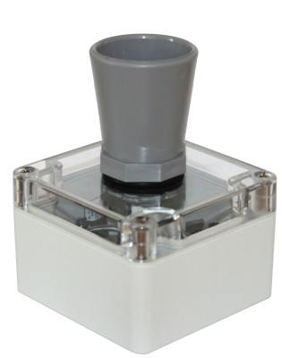
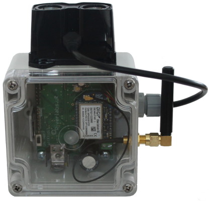

# Logger Identification Guide

!!! abstract "Overview"
    Riverlabs produces two main logger models: **Wari** (ultrasound) and **Lidar**. This guide helps you identify your model and understand its capabilities.

## Model Comparison

-   :material-water-outline:{ .lg .middle } **Wari Logger**

    ---

    **Ultrasound Distance Sensor**

    { width="250" }

    **Sensor:** Maxbotix MB7389  
    **Range:** 0.3m - 5m  
    **Resolution:** 1mm  
    **Beam Angle:** Wide (~15°)  

    **Best For:**
    
    - Water level monitoring
    - Budget-conscious projects
    - Shorter range applications
    - Vertical mounting positions

-   :material-laser-pointer:{ .lg .middle } **Lidar Logger**

    ---

    **Laser Distance Sensor**

    { width="250" }

    **Sensor:** Garmin Lidarlite v3HP  
    **Range:** 0.05m - 35m  
    **Resolution:** 1cm  
    **Beam Angle:** Very narrow (~0.5°)  

    **Best For:**
    
    - Long-range measurements
    - Angled installations (up to 40°)
    - High-precision applications
    - Difficult mounting situations

## Detailed Specifications

### Wari (Ultrasound)

| Specification | Value | Notes |
|--------------|-------|-------|
| **Sensor Type** | Ultrasonic | Maxbotix MB7389 HRXL |
| **Measurement Range** | 0.3m - 5m | Practical range ~4.5m |
| **Resolution** | 1mm | Under ideal conditions |
| **Accuracy** | ±1% | Temperature dependent |
| **Beam Width** | ~15° cone | Requires obstacle clearance |
| **Mounting Angle** | Vertical preferred | Angled mounting reduces accuracy |
| **Target Surface** | Water, solid objects | Good water surface reflectivity |
| **Temperature Range** | -40°C to +65°C | Sensor operating range |
| **Power Consumption** | ~50mA active | Low power between readings |
| **CPU** | Atmel Atmega328 | Arduino Pro Mini compatible |

**Advantages:**

- ✅ Lower cost
- ✅ Proven technology
- ✅ Good for typical water levels
- ✅ Simple to use

**Limitations:**

- ❌ Limited range (5m maximum)
- ❌ Requires vertical mounting
- ❌ Needs clear zone around beam
- ❌ Temperature affects accuracy
- ❌ Minimum distance 0.3m

### Lidar

| Specification | Value | Notes |
|--------------|-------|-------|
| **Sensor Type** | Laser rangefinder | Garmin Lidarlite v3HP |
| **Measurement Range** | 0.05m - 35m | Depends on target reflectivity |
| **Resolution** | 1cm | Consistent across range |
| **Accuracy** | ±2.5cm | Up to 40m |
| **Beam Divergence** | 8 milliradians | Very narrow, <1° effective |
| **Mounting Angle** | Up to 40° | Minimal accuracy loss |
| **Target Surface** | Most surfaces | Best with rough/turbid water |
| **Temperature Range** | -20°C to +60°C | Sensor operating range |
| **Power Consumption** | ~100mA active | Higher but infrequent |
| **CPU** | Atmel Atmega328 | Arduino Pro Mini compatible |

**Advantages:**

- ✅ Extended range (35m)
- ✅ Can measure at angles
- ✅ Very narrow beam (tight spaces)
- ✅ High precision
- ✅ Works from 5cm

**Limitations:**

- ❌ Higher cost
- ❌ Reflectivity dependent
- ❌ Higher power draw when active
- ❌ Poor performance on smooth/clear water

## Physical Identification

### Finding the Model Number

!!! tip "Model Number Location"
    The model designation is typically found on a label on the **back of the enclosure** or **inside the battery compartment**.

**Look for:**

- **"Wari v1"**, **"Wari v2"**, **"Wari v2.1"** - Ultrasound models
- **"WMOnode"**, **"Lidar"** - Lidar models

### Visual Identification

Even without labels, you can identify the logger by its sensor:

=== "Wari (Ultrasound)"

    **Sensor Appearance:**
    
    - Cylindrical sensor housing
    - Mesh grille front face
    - Usually gold/brass colored ring
    - Larger diameter (~2.5cm)
    - Visible transducer behind mesh
    
    **Cable:**
    
    - Typically 3-4 wires
    - Connector or direct solder

=== "Lidar"

    **Sensor Appearance:**
    
    - Rectangular black housing
    - Small circular lens aperture
    - Compact size (~4cm x 2cm x 1.5cm)
    - Red laser warning label (may be present)
    
    **Cable:**
    
    - 6-pin JST or similar connector
    - Color-coded wires

## Use Case Selection

### Choose Wari Ultrasonic If:

- ✅ Measuring water levels in typical conditions
- ✅ Range requirement is under 4 meters
- ✅ Can mount sensor vertically
- ✅ Budget is a primary concern
- ✅ Simple setup is preferred
- ✅ Sufficient clearance around measurement point

**Typical Applications:**

- Small stream monitoring
- Tank level monitoring
- Irrigation canal measurements
- Rain gauge verification
- Shallow well monitoring

### Choose Wari Lidar If:

- ✅ Need measurements beyond 5 meters
- ✅ Must mount at an angle
- ✅ Working in confined spaces
- ✅ Require maximum precision
- ✅ Very smooth/clear water surface
- ✅ Close-range measurements (<30cm)

**Typical Applications:**

- Large river monitoring
- Bridge clearance monitoring
- Deep well measurements
- Angled installations
- High-accuracy applications
- WMO standard installations

Now that you've identified your logger:

- Return to [Quick Start Guide](quick-start.md) to continue setup
- Review [First Deployment Checklist](first-deployment-checklist.md)
- Plan your installation with the [Mounting Guide](../installation/mounting-guide.md)
- Understand power requirements in [Battery & Power Guide](../hardware/battery-power-guide.md)

## Questions?

If you're still unsure which model you have:

1. Check for any documentation included with your logger
2. Look for order/invoice information from Riverlabs
3. Contact support with a photo: info@riverlabs.uk

---

!!! note "Hardware Evolution"
    Riverlabs continuously improves logger designs. The information here reflects current models. Older units may have slight variations but maintain compatibility with current documentation.
